Compare models and historical data
================

## Load the historical data for most recent years

Let’s see how the gravity and radiation model predictions fared for the
three most recent years we have on hand: 2015, 2016, and 2017. We’ll
first load all the data and create matrices from the historical
observations so it’ll be easy to compute the residuals for the gravity
and radiation models, which are already in matrix form.

Note: we’ll be ignoring migrations within states, meaning the diagonals
of these matrices will be zeros.

``` r
# Load the data files

hist_2015 <- read.csv(here("results", "data_cleaning_results", "clean", "US_1516.csv"))
grav_2015 <- as.matrix(read.csv(here("results", "gravity_model_results", "alpha_0.3_year_2015.csv")), nrow = 51, ncol = 51)
rad_2015 <- as.matrix(read.csv(here("results", "radiation_model_results", "alpha_0.3_year_2015.csv")), nrow = 51, ncol = 51)

hist_2016 <- read.csv(here("results", "data_cleaning_results", "clean", "US_1617.csv"))
grav_2016 <- as.matrix(read.csv(here("results", "gravity_model_results", "alpha_0.3_year_2016.csv")), nrow = 51, ncol = 51)
rad_2016 <- as.matrix(read.csv(here("results", "radiation_model_results", "alpha_0.3_year_2016.csv")), nrow = 51, ncol = 51)

hist_2017 <- read.csv(here("results", "data_cleaning_results", "clean", "US_1718.csv"))
grav_2017 <- as.matrix(read.csv(here("results", "gravity_model_results", "alpha_0.3_year_2017.csv")), nrow = 51, ncol = 51)
rad_2017 <- as.matrix(read.csv(here("results", "radiation_model_results", "alpha_0.3_year_2017.csv")), nrow = 51, ncol = 51)

# Create matrices from historical data
hist_matrix_2015 <- create_historical_matrix(hist_2015)
hist_matrix_2016 <- create_historical_matrix(hist_2016)
hist_matrix_2017 <- create_historical_matrix(hist_2017)
```

### 2015 Data Comparisons

Now let’s see what the heatmaps look like for each of these year’s
predictions.

``` r
gravity_heatmap(grav_2015, hist_matrix_2015, "2015")
```

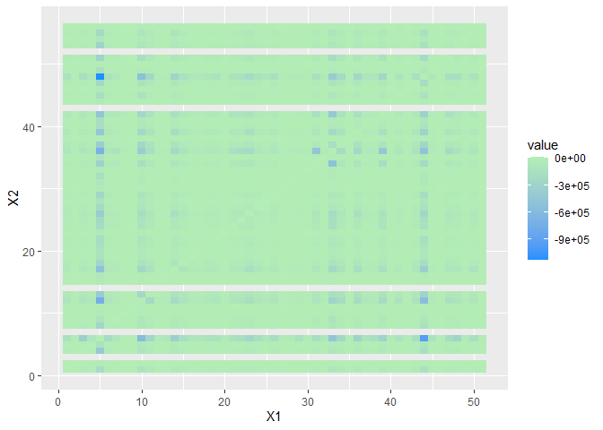<!-- -->

``` r
radiation_heatmap(rad_2015, hist_matrix_2015, "2015")
```

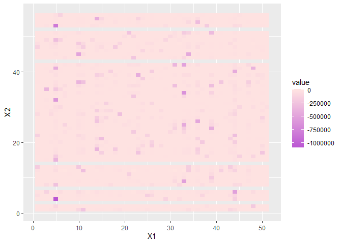<!-- -->

### 2016 Data Comparisons

``` r
gravity_heatmap(grav_2016, hist_matrix_2016, "2016")
```

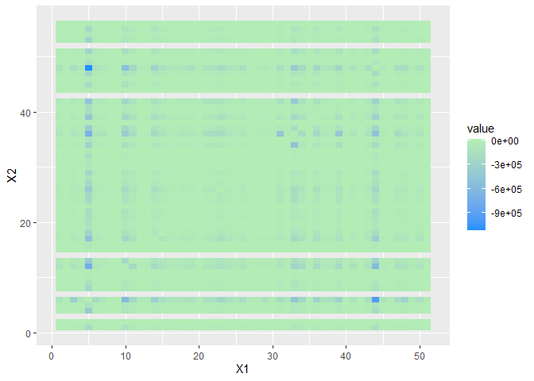<!-- -->

``` r
radiation_heatmap(rad_2016, hist_matrix_2016, "2016")
```

<!-- -->

### 2017 Data Comparisons

``` r
gravity_heatmap(grav_2017, hist_matrix_2017, "2017")
```

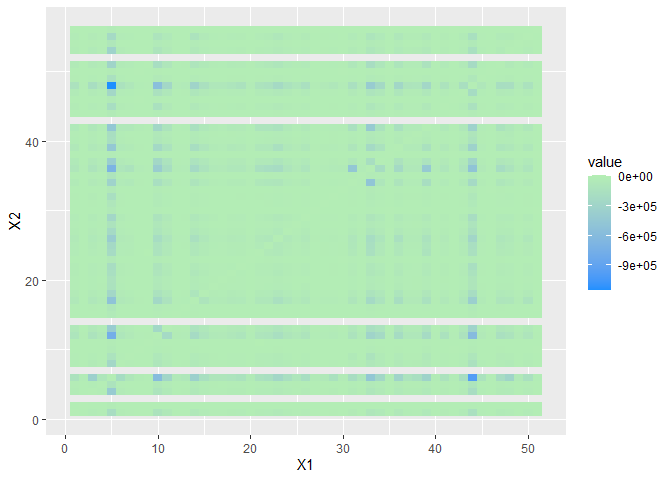<!-- -->

``` r
radiation_heatmap(rad_2017, hist_matrix_2017, "2017")
```

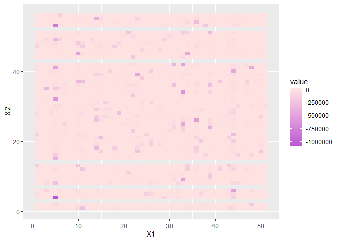<!-- -->

From these maps, we can see that both models overestimate the number of
migrants pretty often, as shown by the darker colors on the heatmaps.
Ideally, both maps would be pretty consistently the lighter color all
across the board, meaning the predictions are closer to the actual
observed value. Overall, we can see that both do an okay job of
estimating the number of migrants (about the same proportions of light
to dark
colors).

## Appendix: remaining years of data comparisons

### 2014

``` r
hist <- read.csv(here("results", "data_cleaning_results", "clean", "US_1415.csv"))
grav <- as.matrix(read.csv(here("results", "gravity_model_results", "alpha_0.3_year_2014.csv")), nrow = 51, ncol = 51)
rad <- as.matrix(read.csv(here("results", "radiation_model_results", "alpha_0.3_year_2014.csv")), nrow = 51, ncol = 51)
hist_matrix <- create_historical_matrix(hist)
gravity_heatmap(grav, hist_matrix, "2014")
```

<!-- -->

``` r
radiation_heatmap(rad, hist_matrix, "2014")
```

<!-- -->

### 2013

``` r
hist <- read.csv(here("results", "data_cleaning_results", "clean", "US_1314.csv"))
grav <- as.matrix(read.csv(here("results", "gravity_model_results", "alpha_0.3_year_2013.csv")), nrow = 51, ncol = 51)
rad <- as.matrix(read.csv(here("results", "radiation_model_results", "alpha_0.3_year_2013.csv")), nrow = 51, ncol = 51)
hist_matrix <- create_historical_matrix(hist)
gravity_heatmap(grav, hist_matrix, "2013")
```

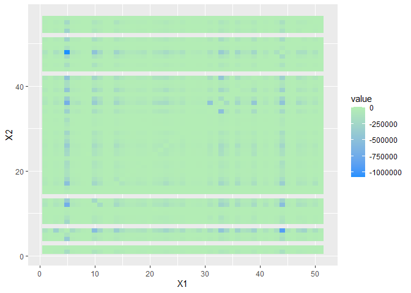<!-- -->

``` r
radiation_heatmap(rad, hist_matrix, "2013")
```

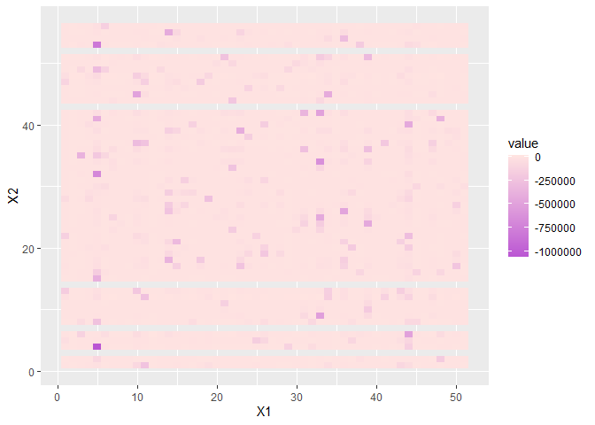<!-- -->

### 2012

``` r
hist <- read.csv(here("results", "data_cleaning_results", "clean", "US_1213.csv"))
grav <- as.matrix(read.csv(here("results", "gravity_model_results", "alpha_0.3_year_2012.csv")), nrow = 51, ncol = 51)
rad <- as.matrix(read.csv(here("results", "radiation_model_results", "alpha_0.3_year_2012.csv")), nrow = 51, ncol = 51)
hist_matrix <- create_historical_matrix(hist)
gravity_heatmap(grav, hist_matrix, "2012")
```

<!-- -->

``` r
radiation_heatmap(rad, hist_matrix, "2012")
```

<!-- -->

### 2011

``` r
hist <- read.csv(here("results", "data_cleaning_results", "clean", "US_1112.csv"))
grav <- as.matrix(read.csv(here("results", "gravity_model_results", "alpha_0.3_year_2011.csv")), nrow = 51, ncol = 51)
rad <- as.matrix(read.csv(here("results", "radiation_model_results", "alpha_0.3_year_2011.csv")), nrow = 51, ncol = 51)
hist_matrix <- create_historical_matrix(hist)
gravity_heatmap(grav, hist_matrix, "2011")
```

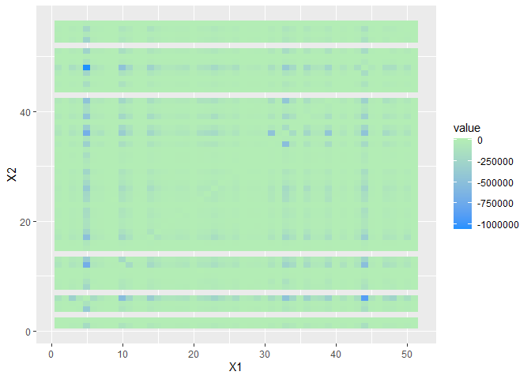<!-- -->

``` r
radiation_heatmap(rad, hist_matrix, "2011")
```

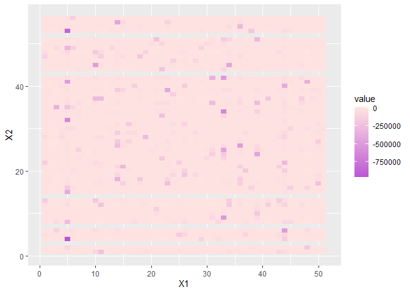<!-- -->

### 2010

``` r
hist <- read.csv(here("results", "data_cleaning_results", "clean", "US_1011.csv"))
grav <- as.matrix(read.csv(here("results", "gravity_model_results", "alpha_0.3_year_2010.csv")), nrow = 51, ncol = 51)
rad <- as.matrix(read.csv(here("results", "radiation_model_results", "alpha_0.3_year_2010.csv")), nrow = 51, ncol = 51)
hist_matrix <- create_historical_matrix(hist)
gravity_heatmap(grav, hist_matrix, "2010")
```

<!-- -->

``` r
radiation_heatmap(rad, hist_matrix, "2010")
```

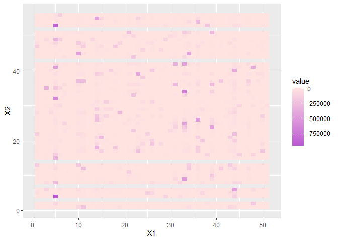<!-- -->

### 2009

``` r
hist <- read.csv(here("results", "data_cleaning_results", "clean", "US_0910.csv"))
grav <- as.matrix(read.csv(here("results", "gravity_model_results", "alpha_0.3_year_2009.csv")), nrow = 51, ncol = 51)
rad <- as.matrix(read.csv(here("results", "radiation_model_results", "alpha_0.3_year_2009.csv")), nrow = 51, ncol = 51)
hist_matrix <- create_historical_matrix(hist)
gravity_heatmap(grav, hist_matrix, "2009")
```

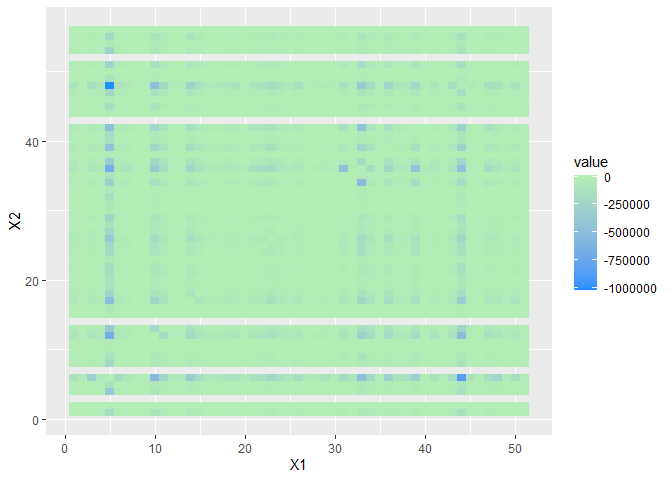<!-- -->

``` r
radiation_heatmap(rad, hist_matrix, "2009")
```

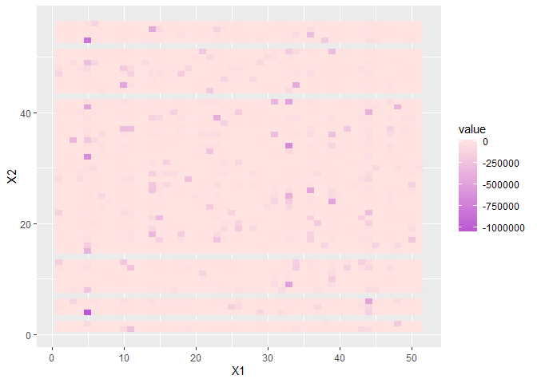<!-- -->
