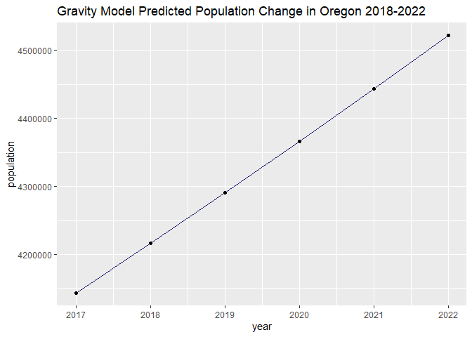
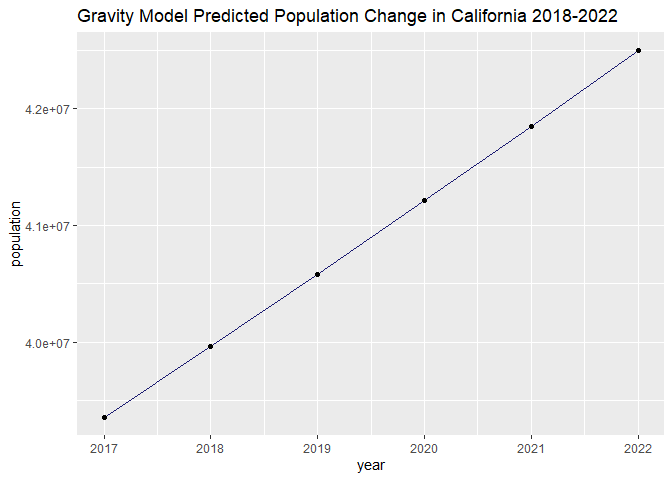
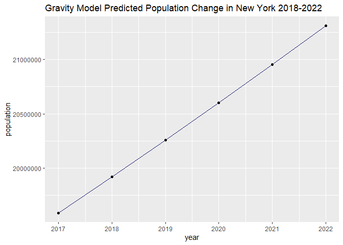
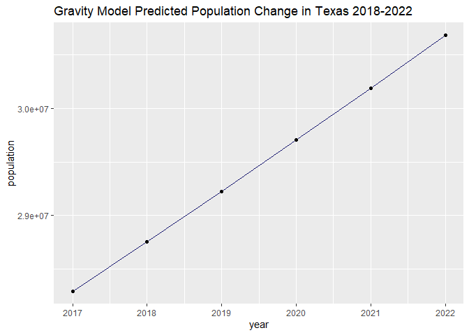
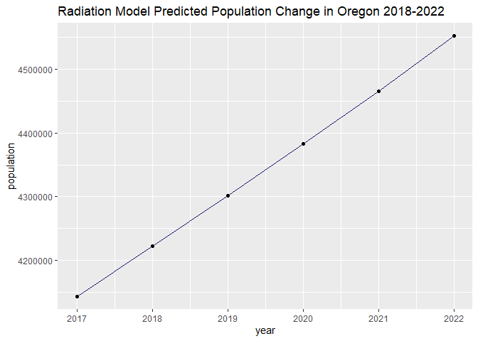
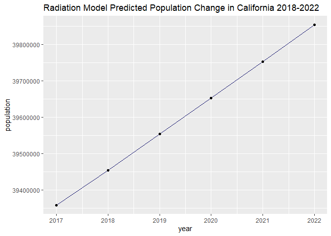
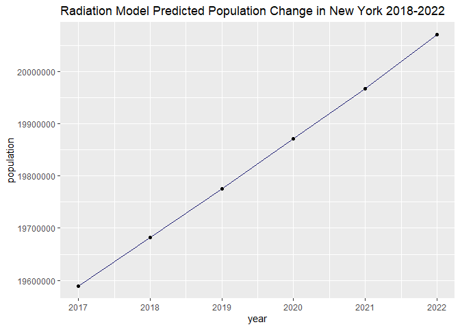
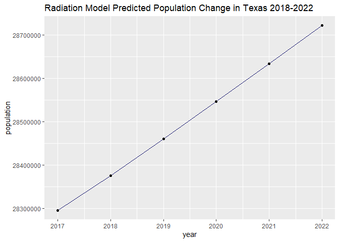

Simulate Future Migration
================

## Find the best alpha value for gravity model simulations

**Optimize alpha**: Let’s find the lowest alpha value that will minimize
the sum of squared residual of the gravity model values.

To do this, let’s use the `optimize()` function, which we know can find
the minimum alpha if we return the sum of squared residuals from the
gravity model predictions. In
[/R/simulation\_functions.R](https://github.com/ST541-Fall2020/ruangroc_project_migration/blob/main/R/simulation_functions.R),
you’ll find the `run_gravity_model()` function that will be used in
combination with optimize.

Also, we know we want to find an alpha that will help us predict
migration flows in the next few years, so we’ll use `optimize()` for the
three most recent years of data we have on hand (2015, 2016, and 2017).
Then we’ll use the average alpha from those three runs to simulate
migration flows in a later
section.

``` r
pop_estimates <- read.csv(here("results", "data_cleaning_results", "population_estimates.csv"))
locations <- read.csv(here("results", "distances_between_states.csv"))

# optimize returns: minimum = alpha, objective = residual value

# minimum alpha = 0.0154
filename <- here("results", "data_cleaning_results", "clean", "US_1516.csv")
optimize(f = run_gravity_model, interval = c(0, 1), year_data = pop_estimates$year_2015, hist_data_file = filename, locations = locations)
```

    ## $minimum
    ## [1] 0.01536115
    ## 
    ## $objective
    ## [1] 34722158391

``` r
# minimum alpha = 0.0204
filename <- here("results", "data_cleaning_results", "clean", "US_1617.csv")
optimize(f = run_gravity_model, interval = c(0, 1), year_data = pop_estimates$year_2016, hist_data_file = filename, locations = locations)
```

    ## $minimum
    ## [1] 0.02041716
    ## 
    ## $objective
    ## [1] 63431034008

``` r
# minimum alpha = 0.0157
filename <- here("results", "data_cleaning_results", "clean", "US_1718.csv")
optimize(f = run_gravity_model, interval = c(0, 1), year_data = pop_estimates$year_2017, hist_data_file = filename, locations = locations)
```

    ## $minimum
    ## [1] 0.01567389
    ## 
    ## $objective
    ## [1] 39617014386

``` r
gravity_alpha <- mean(c(0.0154, 0.0204, 0.0157))
# we'll use alpha = 0.0172 for predicting future migration using gravity model
```

## Find best alpha value for radiation model simulations

**Optimize alpha**: Find the lowest alpha value that will minimize the
least squares residual of the radiation model values.

As we did above, let’s use the `optimize()` function, which we know can
find the minimum alpha if we return the sum of squared residuals from
the radiation model predictions. In
[/R/simulation\_functions.R](https://github.com/ST541-Fall2020/ruangroc_project_migration/blob/main/R/simulation_functions.R),
you’ll find the `run_radiation_model()` function that will be used in
combination with optimize.

Again, we know we want to find an alpha that will help us predict
migration flows in the next few years, so we’ll use `optimize()` for the
three most recent years of data we have on hand (2015, 2016, and 2017).
Then we’ll use the average alpha from those three runs to simulate
migration flows in a later
section.

``` r
pop_estimates <- read.csv(here("results", "data_cleaning_results", "population_estimates.csv"))

# min alpha = 0.0199
S_ij_file <- here("results", "radiation_model_results", "intervening_opportunities_year_2015.csv")
hist_file <- here("results", "data_cleaning_results", "clean", "US_1516.csv")
optimize(f = run_radiation_model, interval = c(0, 1), year_data = pop_estimates$year_2015, S_ij_file = S_ij_file, hist_data_file = filename)
```

    ## $minimum
    ## [1] 0.01986332
    ## 
    ## $objective
    ## [1] 43289732287

``` r
# min alpha = 0.0198
S_ij_file <- here("results", "radiation_model_results", "intervening_opportunities_year_2016.csv")
hist_file <- here("results", "data_cleaning_results", "clean", "US_1617.csv")
optimize(f = run_radiation_model, interval = c(0, 1), year_data = pop_estimates$year_2016, S_ij_file = S_ij_file, hist_data_file = filename)
```

    ## $minimum
    ## [1] 0.01977756
    ## 
    ## $objective
    ## [1] 43347229974

``` r
# min alpha = 0.0194
S_ij_file <- here("results", "radiation_model_results", "intervening_opportunities_year_2017.csv")
hist_file <- here("results", "data_cleaning_results", "clean", "US_1718.csv")
optimize(f = run_radiation_model, interval = c(0, 1), year_data = pop_estimates$year_2017, S_ij_file = S_ij_file, hist_data_file = filename)
```

    ## $minimum
    ## [1] 0.01938091
    ## 
    ## $objective
    ## [1] 43987531512

``` r
radiation_alpha <- mean(c(0.0199, 0.0198, 0.0194))
# we'll use alpha = 0.0197 for predicting future migration using radiation model
```

## Predict migration flows for 2018-2022

Now that we’ve found the most optimal alpha values to use for predicting
future migration, let’s put them to use\!

The most recent data we have is for the 2017-18 tax year, so we’ll use
the population estimates from that year as a starting point. We’ll
calculate population estimates from that point onwards by adding the
migration matrix predictions to the current year’s estimates, and then
feeding that forward to find the following year’s population estimates,
and so on.

**Simulate migrations using gravity
model**

``` r
pop_estimates <- read.csv(here("results", "data_cleaning_results", "population_estimates.csv"))
locations <- read.csv(here("results", "distances_between_states.csv"))
pop_data_2017 <- pop_estimates$year_2017

# get a migration matrix for the year 2018, use it in 2019's prediction, and so on
pop_data_2018 <- get_gravity_prediction(pop_data_2017, 2018, gravity_alpha, locations)
pop_data_2019 <- get_gravity_prediction(pop_data_2018, 2019, gravity_alpha, locations)
pop_data_2020 <- get_gravity_prediction(pop_data_2019, 2020, gravity_alpha, locations)
pop_data_2021 <- get_gravity_prediction(pop_data_2020, 2021, gravity_alpha, locations)
pop_data_2022 <- get_gravity_prediction(pop_data_2021, 2022, gravity_alpha, locations)

# combine them all into a tibble
pop_over_time <- tibble(
  fips = c(1, 2, 4, 5, 6, 8:13, 15:42, 44:51, 53:56),
  state = c("Alabama", "Alaska", "Arizona", "Arkansas", "California", "Colorado",
           "Connecticut", "Delaware", "District of Columbia", "Florida", "Georgia", "Hawaii",
            "Idaho", "Illinois", "Indiana", "Iowa", "Kansas", "Kentucky",
           "Louisiana", "Maine", "Maryland", "Massachusetts", "Michigan", "Minnesota",
           "Mississippi", "Missouri", "Montana", "Nebraska", "Nevada", "New Hampshire",
           "New Jersey", "New Mexico", "New York", "North Carolina", "North Dakota", "Ohio", 
           "Oklahoma", "Oregon", "Pennsylvania", "Rhode Island", "South Carolina", "South Dakota", 
           "Tennessee", "Texas", "Utah", "Vermont", "Virginia", "Washington", 
           "West Virginia", "Wisconsin", "Wyoming"),
  year_2017 = pop_data_2017,
  year_2018 = pop_data_2018,
  year_2019 = pop_data_2019,
  year_2020 = pop_data_2020,
  year_2021 = pop_data_2021,
  year_2022 = pop_data_2022
)

# then visualize the population changes predicted by gravity model for whatever states you want
graph_population_change(pop_over_time, "Oregon", "Gravity")
```

<!-- -->

``` r
graph_population_change(pop_over_time, "California", "Gravity")
```

<!-- -->

``` r
graph_population_change(pop_over_time, "New York", "Gravity")
```

<!-- -->

``` r
graph_population_change(pop_over_time, "Texas", "Gravity")
```

<!-- -->

**Simulate migrations using radiation model**

We’ll repeat the process for the radiation model here, though we’ll also
need to generate new intervening opportunities files for each year in
addition to the radiation model migration
matrices.

``` r
pop_estimates <- read.csv(here("results", "data_cleaning_results", "population_estimates.csv"))
pop_data_2017 <- pop_estimates$year_2017

s_ij_file <- here("results", "radiation_model_results", "intervening_opportunities_year_2017.csv")
new_s_ij_file <- here("results", "simulation_results", "intervening_opportunities_2018.csv")
pop_data_2018 <- get_radiation_prediction(pop_data_2017, s_ij_file, new_s_ij_file, 2018, radiation_alpha)

s_ij_file <- here("results", "simulation_results", "intervening_opportunities_2018.csv")
new_s_ij_file <- here("results", "simulation_results", "intervening_opportunities_2019.csv")
pop_data_2019 <- get_radiation_prediction(pop_data_2018, s_ij_file, new_s_ij_file, 2019, radiation_alpha)

s_ij_file <- here("results", "simulation_results", "intervening_opportunities_2019.csv")
new_s_ij_file <- here("results", "simulation_results", "intervening_opportunities_2020.csv")
pop_data_2020 <- get_radiation_prediction(pop_data_2019, s_ij_file, new_s_ij_file, 2020, radiation_alpha)

s_ij_file <- here("results", "simulation_results", "intervening_opportunities_2020.csv")
new_s_ij_file <- here("results", "simulation_results", "intervening_opportunities_2021.csv")
pop_data_2021 <- get_radiation_prediction(pop_data_2020, s_ij_file, new_s_ij_file, 2021, radiation_alpha)

s_ij_file <- here("results", "simulation_results", "intervening_opportunities_2021.csv")
new_s_ij_file <- here("results", "simulation_results", "intervening_opportunities_2022.csv")
pop_data_2022 <- get_radiation_prediction(pop_data_2021, s_ij_file, new_s_ij_file, 2022, radiation_alpha)

# combine them all into a tibble
pop_over_time <- tibble(
  fips = c(1, 2, 4, 5, 6, 8:13, 15:42, 44:51, 53:56),
  state = c("Alabama", "Alaska", "Arizona", "Arkansas", "California", "Colorado",
           "Connecticut", "Delaware", "District of Columbia", "Florida", "Georgia", "Hawaii",
            "Idaho", "Illinois", "Indiana", "Iowa", "Kansas", "Kentucky",
           "Louisiana", "Maine", "Maryland", "Massachusetts", "Michigan", "Minnesota",
           "Mississippi", "Missouri", "Montana", "Nebraska", "Nevada", "New Hampshire",
           "New Jersey", "New Mexico", "New York", "North Carolina", "North Dakota", "Ohio", 
           "Oklahoma", "Oregon", "Pennsylvania", "Rhode Island", "South Carolina", "South Dakota", 
           "Tennessee", "Texas", "Utah", "Vermont", "Virginia", "Washington", 
           "West Virginia", "Wisconsin", "Wyoming"),
  year_2017 = pop_data_2017,
  year_2018 = pop_data_2018,
  year_2019 = pop_data_2019,
  year_2020 = pop_data_2020,
  year_2021 = pop_data_2021,
  year_2022 = pop_data_2022
)

# then visualize the population changes predicted by gravity model for whatever states you want
graph_population_change(pop_over_time, "Oregon", "Radiation")
```

<!-- -->

``` r
graph_population_change(pop_over_time, "California", "Radiation")
```

<!-- -->

``` r
graph_population_change(pop_over_time, "New York", "Radiation")
```

<!-- -->

``` r
graph_population_change(pop_over_time, "Texas", "Radiation")
```

<!-- -->
